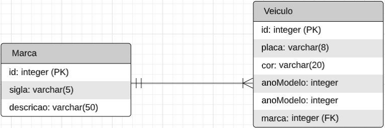

## Alunos:
- Caio Padilha Aguiar

# **Trabalho final de PC3**

*Dado o diagrama entidade-relacionamento a seguir, pede-se:*



*(Valor: $2.0$)*

**a)** *Crie um banco de dados no postgres (SGBD usado na disciplina) chamado ``tfpc3``, nome do usuário do banco ``tfpc3``, senha ``tfpc3`` e porta ``5448``;*

Utilizei o seguinte comando para criar o banco de dados:
```sh
docker run --name pg-tfpc3 -e POSTGRES_USER=tfpc3 -e POSTGRES_PASSWORD=tfpc3 \
-e POSTGRES_DATABASE=tfpc3 -e POSTGRES_ADMIN_PASSWORD=tfpc3 -p 5448:5432 \
-d postgres:alpine3.14
```

Para executar comandos no banco de dados:
```sh
docker exec -it pg-tfpc3 psql -U tfpc3 -W tfpc3
```

*(Valor: $4.0$)*

**b)** *Crie uma API (RESTful - spring boot, o que foi utilizadoda disciplina), conforme aula 13, para fazer o CRUD nas duas tabelas;*

O código fonte da API está na pasta ``api``, e pode ser executada pelo seguinte comando:
```sh
java -jar api-0.0.1-SNAPSHOT.jar
```

*(Valor: $4.0$)*

**c)** *Crie o frontend em Angular (framework utilizado na disciplina), que deve conter uma página principal com um menu contendo opções de cadastrar marca, cadastrar veículos (as marcas deverão ser listadas em um combo box no momento do cadastro do veículo), listar veículos (devem ser exibidos os dados do veículo e a marca dele, juntamente com as opções de excluir e editar) e listar marcas (com as opções de excluir e editar).*
